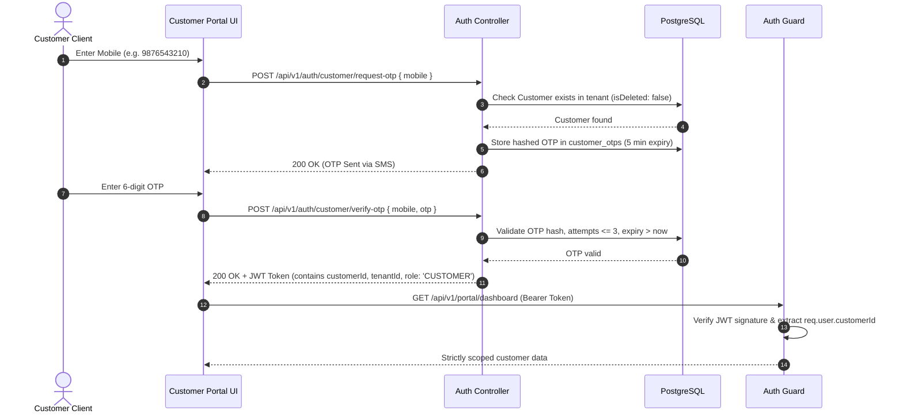

# Architecture & Implementation Plan: Customer Portal Module

This document defines the complete architectural design and implementation plan for the **Customer Self-Service Portal** in the Tailor Management SaaS platform.

> [!IMPORTANT]
> **Strict Architectural Constraints & Business Rules**:
> 1. **Zero Customer Online Payments**: Absolutely **NO** Razorpay, Stripe, payment links, webhooks, or online checkout. The portal only displays manual ledger records entered by authorized shop desk staff.
> 2. **Single Source of Truth**: Reuses existing centralized formulas ($\text{Gross} - \text{Discount} + \text{GST} = \text{Net}$; $\text{Net} - \text{Paid} = \text{Balance Due}$) without duplicate billing math.
> 3. **Strict Customer Ownership & Tenant Isolation**: Every customer request derives identity strictly from the cryptographically verified JWT token (`req.user.customerId` and `req.tenantId`). Direct ID parameter passing without backend ownership validation is strictly forbidden.
> 4. **Zero Internal Data Leakage**: Internal shop notes, craftsman assignments, delay reasons, staff workload, audit logs, and business reports are strictly stripped at the database query level.
> 5. **Zero Prisma Migrations**: Reuses existing Prisma schema models (`Customer`, `CustomerOtp`, `Order`, `OrderItem`, `OrderItemMeasurement`, `Payment`, `Trial`, `CustomerPreference`).

---

## 1. Codebase Audit & Existing Architecture Findings

### A. Component Reuse & Gap Analysis
| Component | Existing Implementation | Reusability Assessment & Gaps |
| :--- | :--- | :--- |
| **Customer Model** | [`backend/prisma/schema.prisma`](file:///c:/Users/Reshma/Desktop/Tailor%20system%20application/backend/prisma/schema.prisma) (`Customer`) | Complete schema (`id`, `customerId`, `firstName`, `lastName`, `mobile`, `email`, `address`, `city`, `tenantId`). |
| **OTP Auth System** | [`backend/src/modules/auth/authController.ts`](file:///c:/Users/Reshma/Desktop/Tailor%20system%20application/backend/src/modules/auth/authController.ts) | Implements `requestCustomerOtp` and `verifyCustomerOtp` using `CustomerOtp` table. Issues JWT with `role: 'CUSTOMER'` and `customerId`. |
| **Auth Guard** | [`backend/src/middleware/authGuard.ts`](file:///c:/Users/Reshma/Desktop/Tailor%20system%20application/backend/src/middleware/authGuard.ts) | Decodes verified JWT, strictly sets `req.tenantId = decoded.tenantId` and `req.user = decoded`. Prevents tenant spoofing. |
| **RBAC Guard** | [`backend/src/middleware/rbacGuard.ts`](file:///c:/Users/Reshma/Desktop/Tailor%20system%20application/backend/src/middleware/rbacGuard.ts) | `ROLE_PERMISSIONS['CUSTOMER'] = ['portal:view']`. Customer is blocked from all internal shop routes. |
| **Portal Controller** | [`backend/src/modules/customer-portal/customerPortalController.ts`](file:///c:/Users/Reshma/Desktop/Tailor%20system%20application/backend/src/modules/customer-portal/customerPortalController.ts) | Contains initial `getMyPortal` method with data aggregation. Lacks separate endpoints for single order details, receipts, and profile updating. |
| **Portal Routes** | [`backend/src/modules/customer-portal/customerPortalRoutes.ts`](file:///c:/Users/Reshma/Desktop/Tailor%20system%20application/backend/src/modules/customer-portal/customerPortalRoutes.ts) | Mounted at `/api/v1/portal` and `/api/v1/customer-portal`. **CRITICAL GAP FOUND**: Lines 23-30 contained a debug fallback `if (!customerId) customerId = firstCust?.id;`. This must be removed to enforce strict `req.user.customerId`. |
| **Billing Ledger** | [`backend/src/modules/payments/paymentCalculationService.ts`](file:///c:/Users/Reshma/Desktop/Tailor%20system%20application/backend/src/modules/payments/paymentCalculationService.ts) | Reusable `PaymentCalculationService.calculateOrderBilling` and `round2` for exact monetary balance display. |
| **Frontend Portal** | [`frontend/src/pages/customer-portal/CustomerPortalPage.tsx`](file:///c:/Users/Reshma/Desktop/Tailor%20system%20application/frontend/src/pages/customer-portal/CustomerPortalPage.tsx) | Monolithic prototype. Needs modular routing (`/portal/orders`, `/portal/orders/:id`, `/portal/profile`, `/portal/measurements`), canonical status stepper, and mobile-first navigation. |
| **Frontend Auth** | [`frontend/src/pages/auth/CustomerOtpPage.tsx`](file:///c:/Users/Reshma/Desktop/Tailor%20system%20application/frontend/src/pages/auth/CustomerOtpPage.tsx) | Mobile OTP login page at `/portal/login`. Fully functional with SMS request, verification, and session storage. |

---

## 2. Customer Authentication & Identity Lifecycle



### A. Identity Derivation Principles
1. **Never trust frontend IDs**: Endpoints must **never** accept `customerId` from request body or query params to establish customer identity.
2. **Cryptographic JWT Signature**: Customer identity is derived exclusively from `req.user.customerId`, which is signed by the backend server with `config.jwtSecret`.
3. **Session Token Contract**:
   ```json
   {
     "id": "c0a8012b-7e12-4f3e-8c9d-123456789abc",
     "customerId": "c0a8012b-7e12-4f3e-8c9d-123456789abc",
     "tenantId": "t1a8012b-7e12-4f3e-8c9d-987654321def",
     "name": "Rajesh Kumar",
     "mobile": "9876543210",
     "role": "CUSTOMER"
   }
   ```
4. **Logout Mechanism**: `logout()` clears `tailor_token` and `tailor_user` from `localStorage` and routes the client back to `/portal/login`.

---

## 3. Customer-Visible Data Contract

To guarantee absolute data privacy and security, data is sanitized at the **Prisma database selection layer** (`select: { ... }`), ensuring internal shop fields are never transmitted over the wire:

### Customer-Visible vs Strictly Restricted Fields
| Domain | Customer-Visible Fields | Strictly Restricted / Hidden Fields |
| :--- | :--- | :--- |
| **Customer** | `id`, `customerId`, `firstName`, `lastName`, `mobile`, `email`, `address`, `city` | Internal notes (`notes`), soft-delete markers (`isDeleted`, `deletedAt`), tenant config |
| **Orders** | `id`, `orderNumber`, `createdAt`, `deliveryDate`, `status`, `paymentStatus`, `totalAmount`, `discountAmount`, `netAmount`, `paidAmount`, `balanceAmount`, `customerNotes` | Staff internal notes (`internalNotes`), delay blame reason (`delayReason`), internal revised dates, staff IDs, demo flags (`isDemo`) |
| **Order Items** | `id`, `quantity`, `totalItemPrice`, `status`, `customerNotes`, `garmentType` (`name`, `category`), `measurementSnapshot` (`valuesSnapshot`, `unit`) | Tailor charges, fabric margin charges, urgent extra fees, craftsman notes |
| **Production** | Customer-friendly stage name, appointment/trial date | Assigned craftsman (`assignedToId`, `cutterId`, `tailorId`, `finisherId`), staff names, stage histories, job notes |
| **Payments** | `receiptNumber`, `amount`, `paymentMethod` (CASH, UPI, CARD, BANK_TRANSFER, OTHER), `createdAt` | Reversal notes, recordedById (cashier staff ID), internal audit logs, double-entry correction records |
| **Measurements** | Latest approved values snapshot (`versions[0].values`), unit (`INCHES` / `CENTIMETERS`), garment type | Internal drafting notes, cutter compensation formulas, draft versions |

---

## 4. Order Status Tracking & Customer Mapping

The system has two internal database enum systems:
- `OrderStatus`: `RECEIVED`, `IN_PROGRESS`, `TRIAL_PENDING`, `ALTERATION_PENDING`, `READY_FOR_PICKUP`, `DELIVERED`, `CANCELLED`
- `ProductionStageName`: `RECEIVED`, `CUTTING`, `STITCHING`, `FINISHING`, `TRIAL`, `ALTERATION`, `READY`, `DELIVERED`

### Canonical Customer-Facing Stepper Mapping
To avoid exposing technical internal enums, the portal maps database states into a clear 7-stage visual timeline:

```
[1] Order Received ──> [2] Cutting & Prep ──> [3] Tailoring & Stitching ──> [4] Trial Fitting ──> [5] Alteration (if needed) ──> [6] Ready for Pickup ──> [7] Delivered
```

| Canonical Stage Key | Internal DB Triggers (`OrderStatus` / `ProductionStageName`) | Customer-Facing Title | Customer-Facing Description |
| :--- | :--- | :--- | :--- |
| `ORDER_RECEIVED` | `OrderStatus.RECEIVED`, `ProductionStageName.RECEIVED` | **Order Confirmed** | Your bespoke garment order is booked and measurements are verified. |
| `CUTTING` | `OrderStatus.IN_PROGRESS`, `ProductionStageName.CUTTING` | **Fabric Cutting & Drafting** | Master cutter is drafting and hand-cutting patterns to your measurements. |
| `STITCHING` | `OrderStatus.IN_PROGRESS`, `ProductionStageName.STITCHING` or `FINISHING` | **Tailoring & Hand Assembly** | Artisan tailors are crafting the garment with precision stitchwork. |
| `TRIAL` | `OrderStatus.TRIAL_PENDING`, `ProductionStageName.TRIAL` | **Fitting & Trial Ready** | Your garment is basted and ready for your personalized fitting trial. |
| `ALTERATION` | `OrderStatus.ALTERATION_PENDING`, `ProductionStageName.ALTERATION` | **Precision Alterations** | Refining garment drape and seams based on trial feedback. |
| `READY` | `OrderStatus.READY_FOR_PICKUP`, `ProductionStageName.READY` | **Ready for Pickup** | Finished, pressed, quality-inspected, and waiting at the shop desk. |
| `DELIVERED` | `OrderStatus.DELIVERED`, `ProductionStageName.DELIVERED` | **Delivered** | Order successfully collected and handed over. |
| `CANCELLED` | `OrderStatus.CANCELLED` | **Order Cancelled** | Booking cancelled. Contact shop desk for balance settlement. |

---

## 5. Payment & Billing Data Contract (Manual Ledger Records Only)

> [!CAUTION]
> **Strict Operational Requirement**:
> - NO Razorpay, Stripe, payment links, webhooks, or online checkout.
> - The Customer Portal is purely an **informational billing ledger view**.

### Centralized Ledger Calculation
The portal strictly displays the numbers calculated by the backend using the verified store ledger:
$$\text{Gross Amount} - \text{Discount Amount} + \text{GST Amount} = \text{Net Order Total}$$
$$\text{Net Order Total} - \text{Total Paid Amount} = \text{Balance Due}$$

### Customer Portal Billing Display Structure
```typescript
interface CustomerBillingSummary {
  grandTotal: number;       // Final Net Amount
  totalPaid: number;        // Sum of verified payments
  balanceDue: number;       // Remaining balance to settle
  paymentStatus: 'PAID' | 'PARTIAL' | 'UNPAID';
  payments: Array<{
    receiptNumber: string;  // e.g. "REC-2026-1001"
    amount: number;         // e.g. 2500.00
    paymentMethod: string;  // CASH, UPI, CARD, BANK_TRANSFER
    date: string;           // ISO 8601 date string
  }>;
  storeNotice: string;      // "Payments are accepted in-store via Cash, UPI, or Card at trial/pickup."
}
```

---

## 6. Measurements Architecture & Read-Only Exposure

1. **Read-Only Master Fit Profile**:
   - Customers can inspect their approved measurement dimensions (e.g. Chest: 40", Waist: 34", Sleeve: 25").
   - Shows garment type name, unit system (`INCHES` or `CENTIMETERS`), and verification date.
2. **Immutable Historical Order Snapshots**:
   - Each order item displays the exact measurements that were frozen at the time of order intake (`OrderItemMeasurement.valuesSnapshot`).
   - Assures the customer that recent changes to their profile did not alter previously cut orders.
3. **No Direct Customer Self-Editing**:
   - Customers cannot directly type or modify measurement numbers in the portal. Hand-calibrated alterations require physical fitting verification by the cutter/tailor.
   - Customers can click a button: **"Request Measurement Update / Fitting Session"**, which prompts them to contact the atelier or book an in-person appointment.

---

## 7. Customer Profile & Safe Self-Service Editing

### A. Profile Data View
- Full Name: `firstName`, `lastName`
- Mobile: Registered contact phone (read-only)
- Customer ID: Unique code e.g. `CUST-10006` (read-only)
- Email: Contact email
- Address & City: Home/Delivery address
- Preferences: Fit Preference (`SLIM`, `REGULAR`, `RELAXED`), Preferred Channel (`WHATSAPP`, `SMS`, `EMAIL`)

### B. Safe Profile Update Policy
Customers can update select contact and preference fields through `PUT /api/v1/portal/profile`.
- **Allowed Updates**: `email`, `address`, `city`, `fitPreference`, `preferredContactMethod`.
- **Strictly Immutable / Rejected Fields**:
  - `id`, `customerId`, `tenantId` (ownership tampering rejected)
  - `mobile` (primary login key; must be changed in-store with staff verification)
  - `notes`, `isDeleted`, `createdAt` (administrative fields rejected)

---

## 8. Customer-Facing Dashboard Architecture

The Customer Dashboard is a focused, clean command center designed for rapid mobile scanning:

```
┌──────────────────────────────────────────────────────────────┐
│  [Bespoke Atelier Logo]          Welcome, Rajesh Kumar  [🚪] │
├──────────────────────────────────────────────────────────────┤
│  Hello, Rajesh!                                              │
│  Track your bespoke tailoring orders and fitting trials.     │
│                                                              │
│  ┌──────────────┐ ┌──────────────┐ ┌──────────────────────┐  │
│  │ ACTIVE ORDERS│ │ READY PICKUP │ │ OUTSTANDING BALANCE  │  │
│  │      2       │ │      1       │ │       ₹2,500         │  │
│  └──────────────┘ └──────────────┘ └──────────────────────┘  │
├──────────────────────────────────────────────────────────────┤
│  🎯 CURRENT ORDER PROGRESS                                   │
│  Order #ORD-2026-1002 — Italian Tuxedo (2 Items)             │
│  Delivery Promised: 15 Oct 2026                              │
│                                                              │
│  [✓] Received ─> [✓] Cutting ─> [●] Tailoring ─> [ ] Ready   │
│  Status: Artisan tailors are hand-assembling lapels & seams. │
│  [ View Full Order Details -> ]                              │
├──────────────────────────────────────────────────────────────┤
│  📋 ORDER HISTORY (Recent 5 Orders)                          │
│  • ORD-2026-1002 | Tuxedo   | In Tailoring | Due: 15 Oct     │
│  • ORD-2026-0988 | Bandhgala| Delivered    | Paid: ₹12,000   │
├──────────────────────────────────────────────────────────────┤
│  📏 MY MASTER FIT PROFILE                                    │
│  Suit / Blazer (Verified 02 Sep 2026) — 8 Dimensions        │
└──────────────────────────────────────────────────────────────┘
```

---

## 9. Frontend Routing & Mobile-First Component Hierarchy

### A. Route Structure
All customer-facing routes reside under `/portal/*`, protected by a dedicated `CustomerProtectedRoute` (allowing `RoleType.CUSTOMER` and staff roles):

| Route | Component | Purpose |
| :--- | :--- | :--- |
| `/portal/login` | [`CustomerOtpPage.tsx`](file:///c:/Users/Reshma/Desktop/Tailor%20system%20application/frontend/src/pages/auth/CustomerOtpPage.tsx) | Mobile OTP login page (already implemented). |
| `/portal` | `CustomerDashboardPage.tsx` | Summary KPI cards, current order spotlight, and quick actions. |
| `/portal/orders` | `CustomerOrdersListPage.tsx` | Active and historical order cards with status badges and search. |
| `/portal/orders/:id` | `CustomerOrderDetailPage.tsx` | Order timeline stepper, garments list, snapshots, and payment ledger. |
| `/portal/measurements` | `CustomerMeasurementsPage.tsx` | Master fit profile cards displaying verified body dimensions. |
| `/portal/profile` | `CustomerProfilePage.tsx` | Personal contact details, delivery address, and fit preferences editor. |

### B. Mobile-First Shell Component (`CustomerPortalLayout.tsx`)
1. **Sticky Header**: Atelier branding, shop phone link, customer greeting, and sign-out button.
2. **Bottom Navigation Bar (Mobile)**:
   - 🏠 Dashboard
   - 📦 Orders
   - 📏 Fit Profile
   - 👤 Profile
3. **Desktop Header Navigation**: Horizontal tabs with active indicators.

---

## 10. Backend API Specification

All endpoints reside under `/api/v1/portal`, guarded by `tenantContext`, `authGuard`, and `requireRoles(RoleType.CUSTOMER, RoleType.SHOP_OWNER, RoleType.MANAGER)`:

### Endpoint Roster

#### 1. `GET /api/v1/portal/dashboard`
- **Purpose**: Fast aggregated dashboard payload for the customer home screen.
- **Security**: Derives `customerId = req.user.customerId`.
- **Response**:
  ```json
  {
    "success": true,
    "data": {
      "customer": { "name": "Rajesh Kumar", "customerId": "CUST-10006" },
      "kpis": {
        "activeOrdersCount": 2,
        "readyForPickupCount": 1,
        "nearestDeliveryDate": "2026-10-15T00:00:00.000Z",
        "totalBalanceDue": 2500
      },
      "currentOrderSpotlight": {
        "id": "ord-uuid-1",
        "orderNumber": "ORD-2026-1002",
        "status": "IN_PROGRESS",
        "deliveryDate": "2026-10-15T00:00:00.000Z",
        "itemCount": 2,
        "garmentSummary": "2-Piece Wool Suit"
      }
    }
  }
  ```

#### 2. `GET /api/v1/portal/orders`
- **Purpose**: List of all orders belonging to authenticated customer.
- **Security**: `where: { tenantId: req.tenantId, customerId: req.user.customerId }`.
- **Response**: Array of sanitized order summaries sorted by `createdAt: 'desc'`.

#### 3. `GET /api/v1/portal/orders/:id`
- **Purpose**: Full details for a single order.
- **Security**: `where: { id: req.params.id, customerId: req.user.customerId, tenantId: req.tenantId }`. Returns `404` if not found or unauthorized.
- **Response**: Items with garment types, measurement snapshots, styles, and customer remarks.

#### 4. `GET /api/v1/portal/orders/:id/payments`
- **Purpose**: Payment ledger and receipt breakdown for a specific order.
- **Security**: Strictly scoped to order and authenticated customer.
- **Response**: `grandTotal`, `paidAmount`, `balanceDue`, and list of verified payment receipts.

#### 5. `GET /api/v1/portal/measurements`
- **Purpose**: Verified master measurement profiles.
- **Security**: `where: { tenantId: req.tenantId, customerId: req.user.customerId, isActive: true }`.
- **Response**: Array of garment profiles with latest version values.

#### 6. `GET /api/v1/portal/profile`
- **Purpose**: Customer profile and preferences.
- **Response**: Profile details, contact info, and preferences.

#### 7. `PUT /api/v1/portal/profile`
- **Purpose**: Safe self-service profile update.
- **Body**: `{ email?: string, address?: string, city?: string, preferences?: { fitPreference?: string, preferredContactMethod?: string } }`.
- **Validation**: Strict rejection of mobile, customerId, or tenantId changes.

---

## 11. Role-Based Access Control (RBAC) Matrix

| Endpoint | `CUSTOMER` | `SHOP_OWNER` / `MANAGER` | `CASHIER` | `TAILOR` / `CUTTER` / `FINISHER` | Unauthenticated |
| :--- | :---: | :---: | :---: | :---: | :---: |
| `POST /auth/customer/request-otp` | Public | Public | Public | Public | 200 |
| `POST /auth/customer/verify-otp` | Public | Public | Public | Public | 200 |
| `GET /portal/dashboard` | **Own Data Only** | Staff Preview | 403 | 403 | 401 |
| `GET /portal/orders` | **Own Orders Only** | Staff Preview | 403 | 403 | 401 |
| `GET /portal/orders/:id` | **Own Order Only** | Staff Preview | 403 | 403 | 401 |
| `GET /portal/orders/:id/payments` | **Own Receipts Only**| Staff Preview | 403 | 403 | 401 |
| `GET /portal/measurements` | **Own Profile Only** | Staff Preview | 403 | 403 | 401 |
| `GET /portal/profile` | **Own Profile Only** | Staff Preview | 403 | 403 | 401 |
| `PUT /portal/profile` | **Own Profile Only** | Staff Preview | 403 | 403 | 401 |
| **All Staff Endpoints (`/reports`, `/orders`, `/production`, etc.)** | **403 Forbidden** | Authorized | Role Guarded | Role Guarded | 401 |

---

## 12. Multi-Tenant Isolation & Customer Ownership Guardrails

```mermaid
flowchart TD
    Req[Incoming Customer Request] --> Token[Auth Guard: Verify JWT Token]
    Token -- Invalid Signature / Expired --> Err401[401 Unauthorized]
    Token -- Valid Token --> Extract[Extract req.user.customerId & req.tenantId]
    Extract --> RoleCheck{Is req.user.role == 'CUSTOMER'?}
    RoleCheck -- Yes --> Query[Prisma Query with Compulsory where Clause]
    RoleCheck -- No (Staff) --> StaffCheck{Is Shop Owner / Manager?}
    StaffCheck -- Yes --> StaffQuery[Allow Staff Scoped Query]
    StaffCheck -- No --> Err403[403 Forbidden]
    Query --> TenantScope["where: { tenantId: req.tenantId, customerId: req.user.customerId }"]
    TenantScope --> DB[(PostgreSQL)]
    DB -- Record Not Found / Other Customer's Record --> Err404[404 Not Found (Opaque)]
    DB -- Record Matches Customer & Tenant --> OK[200 OK + Sanitized Data]
```

### Security Guardrails:
1. **Opaque 404 Responses**: If a customer attempts to query another customer's order ID (e.g. `GET /portal/orders/other-customer-order-id`), the API responds with `404 Not Found`, giving zero indication that the order ID exists in another account or tenant.
2. **Double Tenant Boundary**: Every single database query strictly includes `tenantId: req.tenantId` in conjunction with `customerId: req.user.customerId`.
3. **No Database ID Reliance in Frontend URLs**: Where feasible, order numbers (e.g. `ORD-2026-1002`) can be used in routing alongside UUIDs, with backend resolution always validating customer ownership.

---

## 13. Database Schema Assessment (Zero Migrations Required)

An inspection of `backend/prisma/schema.prisma` confirms:
- `Customer`: Contains all necessary client identity attributes (`id`, `customerId`, `tenantId`, `firstName`, `lastName`, `mobile`, `email`, `address`, `city`).
- `CustomerOtp`: Dedicated model for mobile OTP management with bcrypt hash, rate limiting attempts, and expiry tracking.
- `CustomerPreference`: Model exists for fit and communication preferences.
- `Order`, `OrderItem`, `OrderItemMeasurement`, `Payment`, `Trial`: All link directly or relationally to `customerId` and `tenantId`.
- `RoleType.CUSTOMER`: Native enum value in `RoleType`.

**Conclusion**: **ZERO database schema modifications or migrations are required.**

---

## 14. Comprehensive Test Plan

Create `backend/tests/test_customer_portal.ts` covering:

### A. Authentication & Session Security (10 Tests)
1. Request OTP with registered mobile -> 200 OK and OTP created.
2. Request OTP with non-existent mobile -> 404 `CUSTOMER_NOT_FOUND`.
3. Verify OTP with correct code -> 200 OK and JWT token issued with `role: 'CUSTOMER'`.
4. Verify OTP with incorrect code -> 400 `OTP_INCORRECT`.
5. Max verification attempts exceeded (3 failed tries) -> 429 `OTP_MAX_ATTEMPTS`.
6. Expired OTP verification rejected -> 400 `OTP_EXPIRED`.
7. Used OTP cannot be re-verified -> 400 `OTP_EXPIRED`.
8. `GET /auth/me` with customer token returns customer identity and `ROLE_PERMISSIONS['CUSTOMER']`.
9. Expired or malformed Bearer token returns 401 `UNAUTHORIZED`.
10. Customer token contains correct `customerId` and `tenantId`.

### B. Ownership & Tenant Isolation (12 Tests)
11. Customer queries `/portal/dashboard` -> returns only authenticated customer's KPI totals.
12. Customer queries `/portal/orders` -> returns strictly orders where `customerId = req.user.customerId`.
13. Customer A queries Customer B's order ID -> returns 404 `NOT_FOUND` (no data leakage).
14. Customer A queries Customer B's receipt -> returns 404 `NOT_FOUND`.
15. Cross-tenant attempt: Customer from Tenant 1 using Tenant 2 header -> 401/404 blocked.
16. Customer queries `/portal/measurements` -> returns only own verified fit profiles.
17. Customer attempts to query `/portal/orders` with injected `?customerId=` -> ignored, strictly uses token identity.
18. Customer queries `/portal/profile` -> returns own profile data.
19. Customer attempts to update `tenantId` in `PUT /portal/profile` -> strictly ignored/rejected.
20. Customer attempts to update `mobile` in `PUT /portal/profile` -> rejected (immutable identifier).
21. Customer updates `address` and `fitPreference` -> 200 OK and reflected in DB.
22. Soft-deleted customer cannot log in or access portal -> 404 `CUSTOMER_NOT_FOUND`.

### C. Data Sanitization & Internal Information Protection (8 Tests)
23. `GET /portal/orders` strictly omits `internalNotes`.
24. `GET /portal/orders` strictly omits `delayReason`.
25. `GET /portal/orders` strictly omits `assignedToId` and staff assignment details.
26. `GET /portal/orders/:id` exposes only customer-safe notes (`customerNotes`).
27. Order items measurement snapshot displays values without internal drafting formulas.
28. Payment records display receipt and method without internal cashier audit logs.
29. Portal dashboard does not reveal tenant business analytics or store total revenues.
30. Audit log entries are completely inaccessible to customer.

### D. RBAC Boundary Gating (10 Tests)
31. Customer accessing `GET /api/v1/reports/overview` -> 403 `FORBIDDEN_ROLE`.
32. Customer accessing `GET /api/v1/orders` (staff endpoint) -> 403 `FORBIDDEN_ROLE`.
33. Customer accessing `POST /api/v1/orders` -> 403 `FORBIDDEN_ROLE`.
34. Customer accessing `GET /api/v1/payments` (staff endpoint) -> 403 `FORBIDDEN_ROLE`.
35. Customer accessing `POST /api/v1/payments` -> 403 `FORBIDDEN_ROLE`.
36. Customer accessing `GET /api/v1/production/board` -> 403 `FORBIDDEN_ROLE`.
37. Customer accessing `GET /api/v1/customers` (client directory) -> 403 `FORBIDDEN_ROLE`.
38. Customer accessing `GET /api/v1/staff` -> 403 `FORBIDDEN_ROLE`.
39. Shop Owner accessing `/portal/dashboard` on behalf of tenant -> 200 OK (staff preview allowed).
40. Manager accessing `/portal/orders` -> 200 OK.

### E. Financial Math & Zero Online Payment Verification (6 Tests)
41. Order total calculation matches: $\text{Gross} - \text{Discount} + \text{GST} = \text{Net}$.
42. Balance remaining matches: $\text{Net} - \text{Paid} = \text{Balance Due}$.
43. Zero online checkout endpoints exist under `/portal`.
44. Portal payment list reflects only manual ledger entries recorded by store staff.
45. Customer with zero balance shows status `PAID`.
46. Customer with partial payment shows exact remaining balance and status `PARTIAL`.

---

## 15. Implementation Sequence (Phased Roadmap)

```
Phase 1: Backend Security Cleanup & Identity Derivation
  ├── Remove debug fallback in customerPortalRoutes.ts
  └── Enforce strict req.user.customerId validation in all portal handlers

Phase 2: Backend Portal API Expansion
  ├── Implement CustomerPortalController.getDashboard
  ├── Implement CustomerPortalController.getOrderById (with ownership check)
  ├── Implement CustomerPortalController.getOrderPayments
  ├── Implement CustomerPortalController.updateProfile
  └── Cleanly register routes under /api/v1/portal

Phase 3: Frontend Routing & Layout Architecture
  ├── Create CustomerPortalLayout.tsx (Mobile-first bottom bar + desktop header)
  └── Establish clean routes: /portal, /portal/orders, /portal/orders/:id, /portal/measurements, /portal/profile

Phase 4: Customer Dashboard & Current Order Spotlight
  ├── Build CustomerDashboardPage.tsx (KPIs: Active Orders, Ready for Pickup, Balance Due)
  └── Implement active order spotlight card with friendly progress stepper

Phase 5: Order Tracking & Detail Experience
  ├── Build CustomerOrdersListPage.tsx (Filter active vs past orders)
  └── Build CustomerOrderDetailPage.tsx (Canonical 7-stage timeline, garment styles, frozen snapshots, billing summary)

Phase 6: Fit Profile & Safe Profile Management
  ├── Build CustomerMeasurementsPage.tsx (Read-only master fit dimensions)
  └── Build CustomerProfilePage.tsx (Contact info, address, fit preferences editor)

Phase 7: Security, RBAC & Comprehensive Testing
  ├── Create backend/tests/test_customer_portal.ts (46 tests)
  └── Run full regression suite across Customer, Order, Production, Payment, and Reports modules

Phase 8: Build Verification
  ├── Backend TypeScript compilation (npx tsc --noEmit)
  └── Frontend production build (npm run build)
```

---

## 16. Files Expected to be Created / Modified

### Backend Files
- [`backend/src/modules/customer-portal/customerPortalController.ts`](file:///c:/Users/Reshma/Desktop/Tailor%20system%20application/backend/src/modules/customer-portal/customerPortalController.ts): Refactor and implement `getDashboard`, `getOrders`, `getOrderById`, `getOrderPayments`, `getMeasurements`, `getProfile`, and `updateProfile`.
- [`backend/src/modules/customer-portal/customerPortalRoutes.ts`](file:///c:/Users/Reshma/Desktop/Tailor%20system%20application/backend/src/modules/customer-portal/customerPortalRoutes.ts): Remove unsafe debug fallback, attach controller methods, enforce RBAC.
- `backend/tests/test_customer_portal.ts`: Comprehensive 46-test verification suite.

### Frontend Files
- `frontend/src/pages/customer-portal/CustomerPortalLayout.tsx`: Responsive mobile-first layout shell with navigation bar.
- `frontend/src/pages/customer-portal/CustomerDashboardPage.tsx`: Summary dashboard, active orders, balance due, and order spotlight.
- `frontend/src/pages/customer-portal/CustomerOrdersListPage.tsx`: Order history and active order cards.
- `frontend/src/pages/customer-portal/CustomerOrderDetailPage.tsx`: Order detail, 7-stage canonical stepper, garments list, and receipt breakdown.
- `frontend/src/pages/customer-portal/CustomerMeasurementsPage.tsx`: Master fit profile reader.
- `frontend/src/pages/customer-portal/CustomerProfilePage.tsx`: Profile details and fit preference editor.
- [`frontend/src/App.tsx`](file:///c:/Users/Reshma/Desktop/Tailor%20system%20application/frontend/src/App.tsx): Mount child portal routes under `/portal/*`.

---

PLAN ONLY — NO CODE CHANGES MADE
